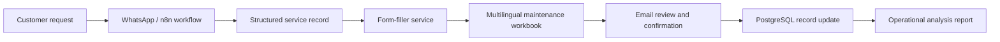
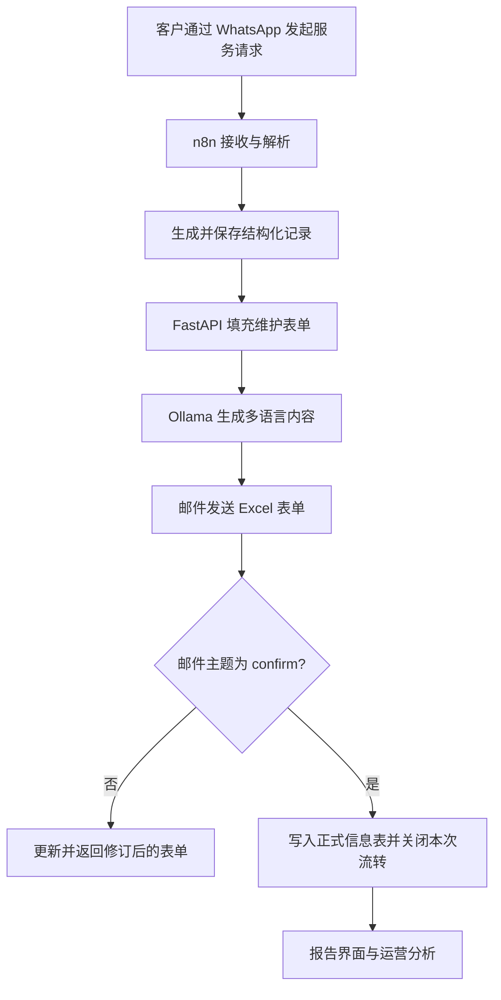
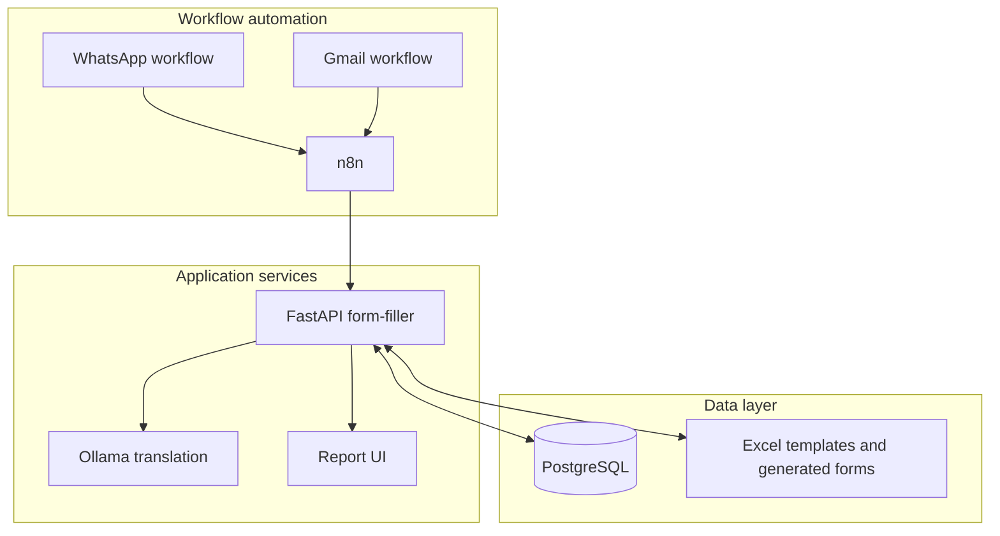
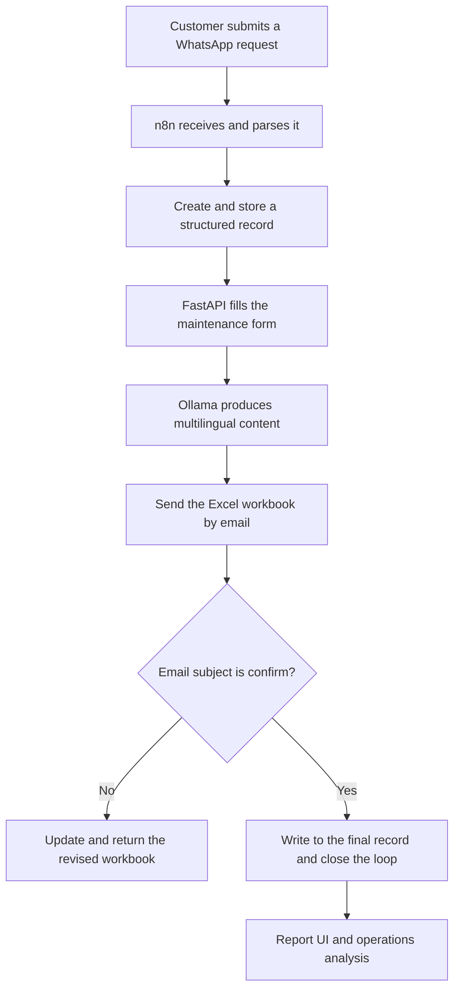

# Agentic AI for After-Sales Operations Automation

[中文](#中文) · [English](#english)

> An Agentic AI workflow for cross-border after-sales operations. It connects customer requests, structured records, multilingual maintenance forms, approval-oriented email loops, and operational reporting into one auditable process.

> 面向跨境售后运营的 Agentic AI 自动化工作流。项目将客户请求、结构化记录、多语言维护表单、邮件确认闭环和运营分析整合为一条可追溯流程。

| Input | Automation layer | Outcome |
|---|---|---|
| WhatsApp requests and email attachments | n8n workflows, FastAPI service, PostgreSQL, Ollama / DeepSeek | Structured records, multilingual workbooks, confirmation loop, and reports |

> **Security boundary:** This public repository intentionally excludes real tokens, API keys, OAuth credentials, and private configuration files. Use your own credentials and follow the setup documentation before deployment.

---

## 中文

### 项目简介

跨境售后运营常面临客户沟通渠道分散、表单依赖邮件往返、信息重复录入和审批状态难以追踪等问题。本项目以 **Agentic AI + 工作流自动化** 为核心，将客户服务请求转化为结构化记录，并自动生成多语言维护表单，支持邮件回传确认、数据库同步以及面向管理者的运营分析。

项目的目标不是替代人工判断，而是减少重复性信息搬运，让售后团队能够更快地完成信息收集、表单流转与后续跟进。

### 端到端流程

### 主要能力

- **多渠道请求接入**：通过 n8n 工作流接收 WhatsApp 消息与邮件附件。
- **结构化信息管理**：使用 PostgreSQL 保存服务记录，降低手工重复录入。
- **多语言维护表单**：自动生成 Excel 维护表单，并支持英文、日文、泰文内容处理。
- **邮件确认闭环**：通过邮件附件回传和 `confirm` 分支完成记录更新与流程收口。
- **运营报告**：FastAPI 服务提供表格数据分析与浏览器端报告界面。
- **可部署架构**：以 Docker Compose 组织 n8n、form-filler、Ollama 和 Cloudflare Tunnel。

### 我的贡献

- 参与调研 Topcon 售后服务场景中的沟通成本与表单流转问题。
- 设计 Agentic AI 驱动的闭环工作流，实现从信息收集到多级审批流转的自动化思路。
- 整合 n8n、PostgreSQL、FastAPI、Excel 模板及邮件流程，构建可追溯的服务记录链路。
- 实现多语言表单生成与邮件回传同步逻辑，并支持结构化运营分析输出。

### 系统架构

### 技术栈

`n8n` · `FastAPI` · `PostgreSQL` · `Docker Compose` · `Ollama` · `DeepSeek API` · `Cloudflare Tunnel` · `WhatsApp Cloud API` · `Gmail` · `Excel`

### 仓库导航

| 目录 / 文件 | 说明 |
|---|---|
| `n8n/imports/` | WhatsApp 与 Gmail 工作流定义 |
| `form-filler/` | 表单生成、回传同步与报告服务 |
| `postgres/info_record.sql` | 记录表初始化脚本 |
| `docker-compose.yml` | 本地服务编排 |
| `n8n/credentials/credential-setup.md` | 凭据配置说明 |
| `cloudflare-whatsapp-setup.md` | Cloudflare Tunnel 与 WhatsApp 配置说明 |

### 快速开始

1. 复制并填写 `.env`，使用自己的密钥、数据库密码和域名。
2. 初始化 PostgreSQL，并执行 `postgres/info_record.sql`。
3. 运行 `docker compose up -d --build` 启动服务。
4. 导入 `n8n/imports/v1.json` 与 `n8n/imports/gmail.json`。
5. 在 n8n 中创建并绑定所需的 WhatsApp、Gmail、Postgres 与 Ollama 凭据。

详细流程请参阅 [`n8n/credentials/credential-setup.md`](n8n/credentials/credential-setup.md)、[`cloudflare-whatsapp-setup.md`](cloudflare-whatsapp-setup.md) 和 [`form-filler/README.md`](form-filler/README.md)。

---

## English

### Overview

Cross-border after-sales teams often work across fragmented customer channels, email-based forms, repeated data entry, and difficult-to-track approvals. This project uses **Agentic AI and workflow automation** to turn service requests into structured records, generate multilingual maintenance forms, support email confirmation, synchronize data, and produce operational reports.

The goal is not to replace human judgment. It reduces repetitive information transfer so service teams can focus on review, coordination, and follow-up.

### End-to-end flow

### Key capabilities

- **Multi-channel intake** through n8n workflows for WhatsApp messages and email attachments.
- **Structured record management** with PostgreSQL to reduce duplicate manual entry.
- **Multilingual maintenance workbooks** with English, Japanese, and Thai content handling.
- **Email confirmation loop** using returned attachments and a `confirm` branch.
- **Operational reporting** through FastAPI-backed data analysis and a browser report workspace.
- **Deployable service composition** with Docker Compose, n8n, form-filler, Ollama, and Cloudflare Tunnel.

### My contribution

- Researched communication and form-circulation pain points in Topcon after-sales operations.
- Designed an Agentic AI closed-loop workflow from information collection through approval routing.
- Integrated n8n, PostgreSQL, FastAPI, Excel templates, and email into a traceable service-record flow.
- Implemented multilingual form generation, email reply synchronization, and structured operational-report output.

### Architecture

### Stack

`n8n` · `FastAPI` · `PostgreSQL` · `Docker Compose` · `Ollama` · `DeepSeek API` · `Cloudflare Tunnel` · `WhatsApp Cloud API` · `Gmail` · `Excel`

### Repository guide

| Path | Purpose |
|---|---|
| `n8n/imports/` | WhatsApp and Gmail workflow definitions |
| `form-filler/` | Form generation, reply synchronization, and reporting service |
| `postgres/info_record.sql` | Initial record-table schema |
| `docker-compose.yml` | Local service composition |
| `n8n/credentials/credential-setup.md` | Credential-configuration guide |
| `cloudflare-whatsapp-setup.md` | Cloudflare Tunnel and WhatsApp setup guide |

### Quick start

1. Create and populate `.env` with your own keys, database password, and domain.
2. Initialize PostgreSQL and run `postgres/info_record.sql`.
3. Start the services with `docker compose up -d --build`.
4. Import `n8n/imports/v1.json` and `n8n/imports/gmail.json` into n8n.
5. Create and bind the required WhatsApp, Gmail, Postgres, and Ollama credentials in n8n.

For the full setup, see [`n8n/credentials/credential-setup.md`](n8n/credentials/credential-setup.md), [`cloudflare-whatsapp-setup.md`](cloudflare-whatsapp-setup.md), and [`form-filler/README.md`](form-filler/README.md).

## Security and privacy

This public repository intentionally does not contain secrets, OAuth tokens, real passwords, or private credential exports. Use a separate `.env` file and your own service credentials. Review the repository setup documents before exposing any tunnel, webhook, or report interface.

## License

See [LICENSE](LICENSE) for licensing information.
